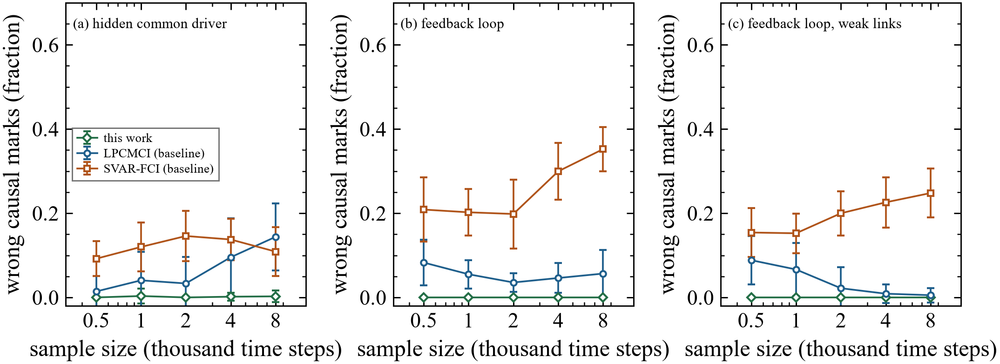
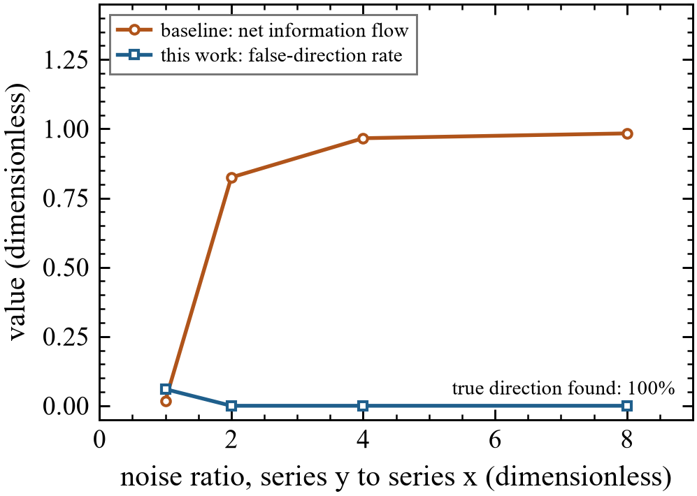

# Causal discovery in markets with hidden drivers

Most of what moves a market is never observed directly: order flow,
positioning, funding stress, news. Prices are also sampled at intervals that
can be too coarse to see which asset moves first. This project is an
end-to-end pipeline that takes observational time series and reports which
causal statements the data support, which ones an unmeasured driver could
explain, and which ones the sampling interval cannot decide. It reports an
undecided link as undecided instead of forcing a direction.

The pipeline is a Python package of about 7,500 lines, with 52 automated tests
against closed-form answers and exact oracles. It runs on a laptop at reduced
settings and on a SLURM cluster at full size. The implementation is private
(see [Code availability](#code-availability)).

## What the pipeline answers

For any multivariate or gridded time series, in order:

1. Is the sampling interval fine enough to tell direction, pair by pair?
2. Where are the regime changes, and which variables change their mechanism
   across them?
3. Which links exist, which have a definite direction, and which could come
   from a hidden common driver?
4. How many hidden drivers are there, and can they be recovered?
5. Which links are nonlinear, and in which regime?
6. How strong is each directed coupling, in information units per unit time?

Every answer carries its own reliability check: false-discovery control on
links, stability under subsampling and aggregation, and bootstrap intervals.

## Results on markets

Data: exchange-traded funds (ETFs) across equities, rates, credit,
commodities, currencies, volatility and crypto; 5-minute bars for two years;
and daily bars for 2007 to 2026. Every number below comes from the full-size
runs on the cluster, with each structure search repeated on 20 subsamples, two
other maximum lags and two coarser sampling intervals.

### Daily data rarely reveal who drives whom


The diagnostic for eight ETFs as the sampling interval grows from 5 minutes to
one day, over 489 trading sessions. Above the dashed line the dependence
between the two assets is too fast for that interval to reveal its direction.
At 5 minutes, 23 of the 28 pairs are already above it, and at one day 24 of 28
are. The five pairs that are resolved at 5 minutes all involve long Treasuries
(TLT) or crude oil (USO). For the equity, credit and volatility complex,
direction needs data finer than 5 minutes.

### Twelve-asset daily network


Twelve ETFs, 499 sessions. (a) Links found; circles mark ends the data leave
undetermined, arrowheads mark definite directions, numbers mark lags in days.
(b) Which pairs are connected at any lag. The data establish who is connected
(equities with implied volatility, equities with credit, the Treasury curve
with credit, the dollar with emerging markets and gold) but, consistent with
the sampling result, almost no directions. 55 of the 66 pairs are unresolved
at one day. All 13 links that pass false-discovery control appear in every one
of the 20 subsamples.

### A microstructure artefact, caught


The same analysis on 5-minute bars, pooling all 489 sessions. Five of the six
same-bar arrowheads point into the dollar ETF (UUP), and so do two lagged
links, from long Treasuries and gold, which appear in every subsample. UUP has
about ten times more stale 5-minute bars than the others (4.9 percent against 0.45 percent), and stale prices make an
illiquid instrument lag liquid ones mechanically. The pipeline flags these
arrowheads as a likely artefact rather than evidence that the dollar is driven
by the rest.

### Twenty years of regimes


Thirteen ETFs and the daily change in the VIX, 4,891 sessions. The regime
breaks were found from the data alone, with no dates supplied: 2009-08-19,
2013-09-24, 2020-02-25 and 2021-02-22, which bracket the end of the financial
crisis, the post-crisis recovery, the long expansion, the COVID year and the
period since. The mechanism of SPY, IWM, IEF, GLD, XLF and XLK changes across
these regimes; EFA, EEM, LQD, HYG, USO, XLE and the VIX show no detectable
change. Nonlinear links concentrate in the crisis regime (small caps, emerging
markets, financials) and, for oil to high-yield credit, after 2020. No lagged
link from one asset to another survives false-discovery control in any regime,
which fits weak daily predictability in liquid markets. Of the 80 links that
do survive, 76 appear in at least 80 percent of the subsamples.

### Three hidden drivers, and the 2021 break


(a) Only three common factors in the twelve daily ETF series rise above what
shuffled data produce; together they carry 69 percent of the variance
(41, 17 and 11 percent). (b) After rotation they read as a risk factor
(equities, high-yield credit and bitcoin load positively, the volatility ETF
at -0.88), a rates factor (long and short Treasuries) and a dollar and gold
factor (gold +0.84, the dollar -0.71). None of the three is a traded series in
the dataset, which is why the network above has so many links without
directions: most of them share one of these drivers. (c) One-year rolling
correlations, with the four regime breaks found above as dotted lines. The
stock and Treasury correlation sat between -0.36 and -0.58 in every regime
before February 2021 and averages +0.08 since; the one-year rolling value has
been positive throughout 2023 to 2026. The Treasury and high-yield correlation
went from between -0.20 and -0.40 to +0.40, and oil decoupled from equities
(+0.33 to +0.58 before, +0.08 after). Long Treasuries stopped hedging equities.

### Volume forecasts volatility, not direction


349 US stocks, 736 trading days, each variable measured against the same day's
cross-sectional average. (a) Today's volume anomaly ranks tomorrow's absolute
return with a rank correlation of +0.064 (t = 19), positive on 76 percent of
days and equal in the two halves of the sample (0.060 and 0.069). The effect
is convex: the lower six deciles are flat and the top decile moves about 0.8
percentage points more than they do the next day. It adds to today's absolute return
rather than repeating it (t = 9.7 with today's absolute return held fixed).
Volume does not predict the sign of tomorrow's return (t = 1.7). (b) The
reverse direction is U-shaped: large moves of either sign raise tomorrow's
volume. Useful for volatility targeting, position sizing and option timing;
useless as a directional signal.

### Intraday lead and lag does not pay for the tick


Every five-minute link found above, and controls, fitted on the first 244
sessions and tested on the next 245. (a) Out-of-sample correlation against
horizon. Treasuries and gold do lead the dollar ETF one bar ahead (0.12 and
0.11), and every signal is inside the no-signal band by 10 minutes. (b) The
gross edge of trading on those forecasts is about 0.6 basis points per trade,
against a one-cent minimum tick of 3.6 basis points on the dollar ETF. The
lead over the dollar ETF is real in the data but far too small to trade, as
expected if it comes from stale prices.

### What holds up, in trading terms

- Direction between liquid ETFs cannot be read from daily or 5-minute bars;
  the sampling diagnostic says so before any search is run.
- The common structure is three hidden drivers, and the regime breaks can
  be dated from the data alone. Since the 2021 break, long Treasuries no
  longer hedge equities.
- Across single stocks, abnormal volume is a stable forecaster of next-day
  volatility and carries no information about direction.
- No cross-asset lead at 5 minutes or longer survives trading costs.

## Validation against known answers

Before touching market data, every stage was scored on simulated systems
whose true causal structure is known.



Fraction of causal marks (arrowheads and tails) that contradict the true
structure, on three systems: a hidden common driver, a feedback loop, and a
feedback loop with some near-vanishing links; 30 simulations per point. Over
all 450 runs this work made 3 wrong marks, each on a link that the
independence tests had wrongly admitted, and none on the feedback systems. Two
standard baselines made up to 14 percent (LPCMCI) and up to 35 percent
(SVAR-FCI) wrong marks, and their error grew with sample size on some
systems.



A trap for direction tests: two series share a hidden driver and have no link
between them, but one is observed with more noise. A standard net
information-flow score points confidently the wrong way (0.82 to 0.98). The
test used here reported a false direction in 3 of 200 trials, all of them in
the equal-noise case where a 5 percent false-alarm rate is expected by design,
and found the true direction in 50 of 50 trials where a real one-way link
existed.

Other checks, each against an exact answer, 50 simulations per setting:

| Check | Result |
|---|---|
| Coupling strength on a benchmark with known value | within 6 percent of the exact value |
| Number of planted hidden drivers | inside the reported range in 300 of 300 trials |
| Recovery of planted hidden drivers | Amari error index 0.009 to 0.034 (0 is perfect) |
| False alarms for nonlinearity on a linear system | 2 to 14 percent at a nominal 10 percent |

## Engineering

- Package: estimators, statistical tests, structure search, diagnostics,
  plotting, a command-line tool and a configuration system. About 5,300 lines
  in the library and 2,200 in applications and scripts.
- Testing: 52 tests pinning each estimator and diagnostic to a closed form or
  an exact oracle, including soundness checks on 40 random graphs with hidden
  nodes.
- High-performance computing: SLURM array jobs on 96-core AMD nodes (Stony
  Brook SeaWulf), with pinned environments and measured run-time and memory
  budgets for every job. The full validation and all market studies finish
  in about an hour of wall time.
- Profiling found and fixed three problems before they cost cluster time: a
  numpy 2.5 incompatibility in a dependency that crashed every
  nonparametric search, a quadrature that needed more than 18 GB of memory
  (now 0.6 GB, with identical results), and a search setting whose cost grew
  roughly with the square of the sample size, replaced for full-size runs.
- Output: journal-style figures, checked automatically for font size, tick
  direction and legend overlap.

Using it on any dataset is one command:

```bash
ecausal-run --data prices.csv --time-col date --dt 1 --time-unit day --out results/prices
```

## Data sources

Polygon.io (daily and 1-minute bars), Yahoo Finance (daily history from
2007), FRED (rates and spreads), and a local store of US stock prices. None of
the data are redistributed here; the figures show derived results only.

## Code availability

The implementation, validation suite and cluster scripts are in a private
repository. Hiring teams can request read access through my GitHub profile.

## Copyright

Copyright (c) 2026 Yaohui Shu. All rights reserved. See [LICENSE](LICENSE).
