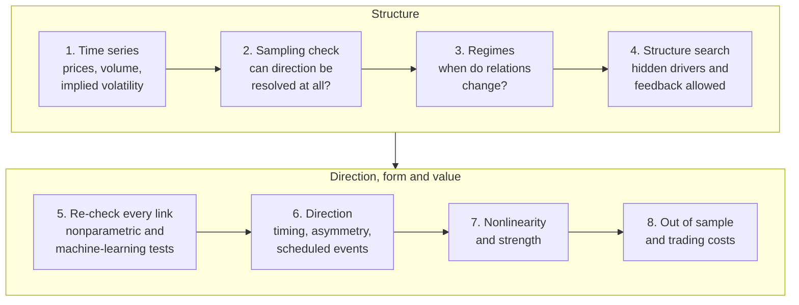

# Causal discovery in markets with hidden drivers


**What I built:** an end-to-end causal discovery pipeline for financial time
series that is honest about what the data cannot tell: it allows for drivers
nobody measured, checks whether the sampling interval can reveal direction at
all, and reports an undecided link as undecided instead of forcing an arrow.

**What I did with it:** tested every stage on thousands of simulated datasets
with known answers, then applied it to twenty years of cross-asset ETF data,
one-minute bars, 349 US stocks, fifteen years of single-company implied
volatility and two years of individual option contracts.

**What I got:** a clear map of what market data can and cannot identify. The
most useful results for a trading desk are negative ones stated precisely
(no tradable lead between liquid funds, implied volatility never leads the
stock), plus a few positive ones that hold up out of sample and across both
halves of the record (hidden drivers explain most co-movement, a datable
2021 break in the stock and bond hedge, volume forecasts volatility, and the
market does not respond detectably to single companies on their earnings
days).

## Contents

1. [Results at a glance](#results-at-a-glance)
2. [What I built](#what-i-built)
3. [Data](#data)
4. [Results](#results)
   1. [Can the data tell who moves first?](#1-can-the-data-tell-who-moves-first)
   2. [The daily network and its hidden drivers](#2-the-daily-network-and-its-hidden-drivers)
   3. [Twenty years of regimes](#3-twenty-years-of-regimes)
   4. [Artefacts and trading costs](#4-artefacts-and-trading-costs)
   5. [Volume forecasts volatility, not direction](#5-volume-forecasts-volatility-not-direction)
   6. [Single companies and their options](#6-single-companies-and-their-options)
   7. [Scheduled events as natural experiments](#7-scheduled-events-as-natural-experiments)
   8. [What machine learning adds](#8-what-machine-learning-adds)
5. [Validation against known answers](#validation-against-known-answers)
6. [What holds up, in trading terms](#what-holds-up-in-trading-terms)
7. [Engineering and skills](#engineering-and-skills)
8. [Data sources, code availability, copyright](#data-sources)

## Results at a glance

| Question | Answer | Evidence |
|---|---|---|
| Can price bars reveal which liquid asset moves first? | Rarely. At one day, 24 of 28 fund pairs are unresolved; even at one minute, 18 of 21 are. | [Fig. 1, 2](#1-can-the-data-tell-who-moves-first) |
| What connects asset classes day to day? | 13 robust links among 12 funds, 10 of which are carried by market-wide drivers that no single fund measures. | [Fig. 3, 4](#2-the-daily-network-and-its-hidden-drivers) |
| How many hidden drivers are there? | Three dominant ones (risk, rates, dollar and gold) carrying 69 percent of the variance. | [Fig. 5](#2-the-daily-network-and-its-hidden-drivers) |
| Do the relations change over time? | Yes, at four breaks dated from the data alone. Since February 2021 long Treasuries no longer hedge equities. | [Fig. 5, 6, 7](#3-twenty-years-of-regimes) |
| Is intraday lead and lag tradable? | No. The strongest lead is a stale-price artefact and earns 0.6 basis points against a 3.6 basis point tick. | [Fig. 8, 9](#4-artefacts-and-trading-costs) |
| Does trading volume predict anything? | Next-day volatility (t = 19 across 349 stocks), not next-day direction (t = 1.7). | [Fig. 10](#5-volume-forecasts-volatility-not-direction) |
| Does a company's implied volatility lead its stock? | No, in fifteen years of data for eleven underlyings. It follows the stock and the VIX on the same day. | [Fig. 11, 12](#6-single-companies-and-their-options) |
| Can same-day directions be settled at all? | Partly, with earnings and Federal Reserve days as natural experiments: the company does not drive the market on its earnings day, in 5 of 5 companies. | [Table](#7-scheduled-events-as-natural-experiments) |
| Does machine learning find hidden predictability? | It finds 160 relations of size (volume and range responding to large moves) and nothing of substance about direction. | [Table](#8-what-machine-learning-adds) |
| Is the method itself reliable? | 3 wrong causal marks in 450 simulated searches, against up to 14 and 35 percent for two standard methods. | [Fig. 13 to 16](#validation-against-known-answers) |

## What I built

A Python package that takes any set of time series and answers, pair by pair
and with a reliability check on every answer:



Design choices that shaped every result:

- **Hidden drivers are the normal case.** The output is a graph in which a
  link can end in an arrowhead (a definite direction), a circle (the data do
  not decide) or arrowheads at both ends (a common driver nobody measured).
- **Direction is only claimed when the data can support it.** A sampling
  diagnostic says, before any search, which pairs move together faster than
  the bar interval; those pairs cannot get a direction from timing.
- **Every claim carries its own check:** false-discovery control, stability
  across 20 subsamples, other maximum lags and coarser sampling, bootstrap
  intervals, a second test on every link, and replication in both halves of
  the record.
- **Validated before use.** Each stage was scored against simulated systems
  whose true answer is known, and three failure modes found there were fixed
  before the market runs.
- **Prediction is reported separately from structure.** A link can be a
  sound statement about dependence and still forecast nothing usable, so
  every lagged link is also tested out of sample and against trading costs.

## Data

| Record | Assets | Resolution | Period | Size |
|---|---|---|---|---|
| Intraday funds | 8 ETFs (equities, Treasuries, credit, gold, oil, dollar, financials, VIX futures) | 5 minutes | Sep 2024 to Sep 2026 | 489 sessions |
| Intraday funds | 7 of those ETFs | 1 minute | Sep 2024 to Sep 2026 | 462 sessions, about 178,000 bars |
| Daily funds | 12 ETFs, plus 22 more used only to measure market-wide drivers | daily | Sep 2024 to Sep 2026 | 499 sessions |
| Long history | 13 ETFs and the VIX | daily | Apr 2007 to Sep 2026 | 4,891 sessions |
| Stock panel | 349 US stocks | daily | Oct 2023 to Sep 2026 | 737 days |
| Implied volatility | Apple, Amazon, Alphabet, Goldman Sachs, IBM, six funds and the S&P 500 | daily | Mar 2011 to Sep 2026 | 3,858 sessions each |
| Option contracts | Apple, NVIDIA, Nasdaq-100 and S&P 500 funds | daily bars of individual contracts | Oct 2024 to Sep 2026 | 485 sessions |
| Scheduled events | earnings releases of the five companies, scheduled FOMC statements | dates and times | 2011 to 2026 | 61 or 62 releases per company, 122 FOMC days |

## Results

### 1. Can the data tell who moves first?

**Mostly not from price bars, and the pipeline says so before searching.**


*Figure 1. How much of each pair's dependence is too fast to order, for eight
ETFs as the sampling interval grows from 5 minutes to one day (489 sessions).
Above the dashed line, the interval cannot reveal the direction.* At 5
minutes, 23 of the 28 pairs are already above it, and at one day 24 of 28 are.
The five pairs resolved at 5 minutes all involve long Treasuries (TLT) or
crude oil (USO).


*Figure 2. The same diagnostic from one-minute bars, seven funds, 462
sessions.* One-minute data do not fix it: 18 of 21 pairs are still
unresolved (1.00 for the S&P 500 with financials, 0.98 with VIX futures, 0.94
with high-yield credit). Only the S&P 500 with long Treasuries (0.14) and two
pairs involving oil fall below the line. Equity, credit and volatility funds
adjust to one another within a minute, as expected when overlapping baskets
and index futures are arbitraged, so ordering them needs trade and quote
records time-stamped well below a minute.

### 2. The daily network and its hidden drivers

**Most daily co-movement runs through a few drivers that no single fund
measures.**


*Figure 3. Twelve ETFs, 499 sessions. (a) Links found: circles mark ends the
data leave undetermined, arrowheads definite directions, numbers the lag in
days. (b) Which pairs are connected at any lag.* The data establish who is
connected (equities with implied volatility, equities with credit, the
Treasury curve with credit, the dollar with emerging markets and gold) but
almost no directions, consistent with Figure 1. All 13 links that pass
false-discovery control appear in every one of 20 subsamples.


*Figure 4. The same network after two refinements of the search, (a) on its
own and (b) with five measured stand-ins P1 to P5 for market-wide drivers,
built from 22 other funds that are not in the graph.* The refinements
removed two lagged links that were artefacts, and a nonparametric re-check
confirmed 21 of the remaining 24 links, including all 13 robust ones. With the
driver stand-ins in the graph, the robust links between funds fall from 13 to
3: the S&P 500 with VIX futures, small caps with financials, and short
Treasuries with high-yield credit. **Ten of the thirteen robust daily
dependences are carried by market-wide drivers;** the three that remain are
the candidates for direct links.


*Figure 5. (a) Only three common factors rise above what shuffled data
produce; together they carry 69 percent of the variance (41, 17 and 11
percent). (b) After rotation: a risk factor (equities, high-yield credit and
bitcoin positive, the VIX futures fund at -0.88), a rates factor (long and
short Treasuries) and a dollar and gold factor (gold +0.84, dollar -0.71).
(c) One-year rolling correlations with the regime breaks found in Section 3.*
The stock and Treasury correlation sat between -0.36 and -0.58 in every
regime before February 2021 and averages +0.08 since; the one-year value has
been positive throughout 2023 to 2026. Treasuries and high-yield credit went
from -0.20 to -0.40 to +0.40, and oil decoupled from equities (+0.33 to +0.58
before, +0.08 after). **Long Treasuries stopped hedging equities.**

### 3. Twenty years of regimes

**The breaks are found from the data alone, and they land where the
macroeconomic history says they should.**


*Figure 6. One causal graph per regime, thirteen ETFs and the daily change in
the VIX, 4,891 sessions from 2007 to 2026.*


*Figure 7. (a) The four breaks found without any dates supplied:
2009-08-19, 2013-09-24, 2020-02-25 and 2021-02-22. (b) Which links are
nonlinear, regime by regime.* The breaks bracket the end of the financial
crisis, the post-crisis recovery, the long expansion, the COVID year and the
period since. The mechanisms of SPY, IWM, IEF, GLD, XLF and XLK change across
regimes; EFA, EEM, LQD, HYG, USO, XLE and the VIX show no detectable change.
Nonlinear links concentrate in the crisis regime (small caps, emerging
markets, financials), and the return-to-volatility link is nonlinear in the
direction the leverage effect predicts. No lagged link from one asset to
another survives false-discovery control in any regime; of the 80 links that
do survive, 76 appear in at least 80 percent of subsamples.

### 4. Artefacts and trading costs

**A statistically real lead can be a recording artefact, and too small to
trade.**


*Figure 8. The five-minute graph, 489 sessions pooled.* Five of the six
same-bar arrowheads point into the dollar ETF (UUP), and so do two lagged
links from long Treasuries and gold that appear in every subsample. UUP has
about ten times more stale five-minute bars than the other funds (4.9 percent
against 0.45 percent), and stale prices make an illiquid instrument lag
liquid ones mechanically. The pipeline flags these arrowheads as a likely
artefact rather than evidence that the dollar is driven by the rest.


*Figure 9. Every five-minute link, fitted on the first 244 sessions and
tested on the next 245. (a) Out-of-sample correlation against horizon. (b)
Gross edge per trade against the one-cent minimum tick.* Treasuries and gold
do lead the dollar ETF one bar ahead (correlations 0.12 and 0.11), every
signal is inside the no-signal band by 15 minutes, and the gross edge of
trading on the forecast is about 0.6 basis points against a 3.6 basis point
tick. **No cross-asset lead at 5 minutes or longer pays for the tick.**

### 5. Volume forecasts volatility, not direction


*Figure 10. 349 US stocks, 736 trading days, each variable measured against
the same day's cross-sectional average. (a) Tomorrow's absolute return by
decile of today's volume anomaly. (b) Tomorrow's volume anomaly by decile of
today's return.* Abnormal volume ranks tomorrow's volatility with a rank
correlation of +0.064 (t = 19), positive on 76 percent of days and equal in
the two halves of the sample (0.060 and 0.069). The effect is convex: the top
decile moves about 0.8 percentage points more the next day than the flat lower
six. It adds to today's absolute return rather than repeating it (t = 9.7),
and it says nothing about the sign of tomorrow's return (t = 1.7). Large
moves of either sign raise tomorrow's volume.

### 6. Single companies and their options

**A company's implied volatility follows its stock; it never leads the next
day's return.**

Eleven underlyings with a Cboe implied-volatility index (Apple, Amazon,
Alphabet, Goldman Sachs, IBM and six funds), 3,858 sessions from 2011 to
2026, one causal search each, with the S&P 500 return and the VIX as
measured market-wide drivers.


*Figure 11. (a) Links robust in at least 6 of the 11 underlyings. Nodes:
market return r_M, VIX change, the underlying's return r, range volatility
v, volume anomaly u and implied-volatility change ΔIV. (b) In how many
underlyings each link is robust.*

- Implied volatility moves with the VIX in all 11 underlyings, with the
  underlying's own return in 10 and with the market return in 7 (all five
  companies). Return and implied volatility move in opposite directions
  (daily correlation -0.24 for IBM to -0.57 for Goldman Sachs).
- Where the data orient these links, every arrowhead points into the implied
  volatility, none out of it.
- No lagged link into a company's return is robust in any of the five
  companies, from its implied volatility, range, volume or the market.


*Figure 12. Every lagged link, fitted on the first half of its record and
tested on the second. A marker is one underlying; filled markers pass all
three checks (significant when fitted, outside the no-signal band, and a
formal test for nested forecasts).* What forecasts is activity, not
direction: a fall in price forecasts a wider range the next day (5 of 5
underlyings), a rise in implied volatility forecasts more trading (5 of 6),
and a wide range forecasts a lower VIX two days later (5 of 5). Median
forecast skills are 0.05 to 0.13.

**Option contracts (two years, Apple, NVIDIA and the Nasdaq-100 fund).** From
daily bars of individual contracts I built at-the-money implied volatility,
a put skew, a call-minus-put spread and option volume. The construction
tracks the Cboe indices (level correlation 0.96). The company's implied
volatility follows the VIX on the same day in all three underlyings, and no
option variable has a robust lead on the next day's return, range or volume.

### 7. Scheduled events as natural experiments

**The fix for "the data cannot decide the direction": use days on which
something known happens.**

An earnings release or a Federal Reserve (FOMC) statement has a date fixed
weeks or months in advance, so nothing in the market causes it, and it hits
some variables and not others. If an event visibly moves one end of a link
and not the other, the unmoved end cannot be driven by the moved one. I
built this as a stage of the pipeline, tested it on simulated markets
(92 to 98 percent of its directions correct), and applied it to the five
companies: 61 or 62 earnings sessions each and 122 FOMC days, each analysed
on days free of the other (15 of Apple's earnings days fall on FOMC days).

What each event moves: earnings sessions move every company variable (the
return 1.8 to 5.8 times as much as usual, implied volatility down by 2.4 to
6.6 standard deviations) and neither market variable; FOMC days lower the
VIX in every record and barely move the market return.

Directions found (B: holds in both halves of the record, 2011 to 2018 and
2018 to 2026; L: later half only; *: also under a stricter setting; -: no
claim):

| Company | market return does not follow the company's return | market return does not follow the company's implied volatility | VIX does not follow the company's implied volatility | volume drives range on earnings days | VIX and company implied volatility share a driver (FOMC) |
|---|---|---|---|---|---|
| Apple | B* | B* | B* | B* | L* |
| Amazon | B* | B* | B* | B | - |
| Alphabet | B* | B* | B* | - | - |
| Goldman Sachs | L | L | B* | - | L* |
| IBM | L | L | B | - | - |

**In all five companies, the company does not move the market or the VIX on
the same day at a detectable size.** That is the direction factor models
assume; here the data support it instead of the model assuming it.

**A forecasting "signal" that was the calendar.** An earlier result said a
day of heavy trading is followed by a fall in implied volatility (t = -2.2 to
-6.6 across the five companies). Without the sessions around each earnings
release it disappears (t = -1.1 to +2.7): volume is already 1.3 to 2.2
standard deviations above normal on the release day, and implied volatility
collapses on the next session by 0.21 to 0.30 in log units. The lead is real
and carries nothing beyond the published earnings calendar.

### 8. What machine learning adds

**I added a gradient-boosted regression test that re-checks every link in
about a second (against minutes for the nonparametric test), validated it,
and re-checked all twelve single-company graphs in nine minutes on one
desktop.**

| | per underlying | total |
|---|---|---|
| links confirmed | 14 to 24 | |
| links not confirmed (mostly weak two-day links) | 0 to 5 | 21 |
| relations the rank-based search missed | 8 to 25 | 193 |
| of which relations of size (volume and range after large moves, volatility clustering) | | 160 |
| of which about the direction of a return | | 2, both with correlations below 0.1 |

Machine learning confirms the graphs, adds links of magnitude, and finds no
new predictability of direction. A first version also exposed a flaw in how
the re-check chose what to condition on (it created spurious links in every
simulated run); the fixed version removes them
([validation](#validation-against-known-answers)). A plain forecasting check
agrees: a nonparametric learner does no better than a linear model on
next-day returns, range or volume.

## Validation against known answers

Every stage was scored on simulated systems whose true causal structure is
known, before and alongside the market work.


*Figure 13. Share of causal marks that contradict the true structure, on a
system with a hidden driver, a feedback loop, and a feedback loop with
near-vanishing links; 30 simulations per point.* Over all 450 runs this work
made 3 wrong marks, each on a link the independence tests had wrongly
admitted, and none on the feedback systems. Two standard methods made up to
14 percent (LPCMCI) and 35 percent (SVAR-FCI) wrong marks, and their error
grew with sample size on some systems.


*Figure 14. A trap for direction tests: two series share a hidden driver and
have no link, but one is noisier.* A standard net information-flow score
points confidently the wrong way (0.82 to 0.98). The test used here reported
a false direction in 3 of 200 trials, all in the equal-noise case where a 5
percent false-alarm rate is expected, and found the true direction in 50 of
50 trials with a real one-way link.


*Figure 15. Two problems found by running the search at up to 64,000 time
steps, and fixed. Adjacency precision (top) and recall (bottom) for three
systems.* On the hidden-driver system the share of reported links that are
real fell as the sample grew (0.86 at 64,000 steps), because the search's own
conditioning created spurious links; the first correction holds it at 0.95 to
0.98 with unchanged recall, and with the second as well precision is 0.99 to
1.00 from 16,000 steps on in all three systems, at some cost in recall on the
hidden-driver system (0.72 instead of 0.83), because very weak true links are
dropped on purpose.


*Figure 16. Measuring a hidden driver from outside the graph. Six series with
five true links and one hidden driver.* Without a stand-in the search reports
about 26 links, only 19 to 20 percent of them real, because the hidden driver
connects everything. With a stand-in built from 100 or more other series, it
reports 7 links with precision 0.71 to 0.75, as good as using the true driver
itself. This is the check behind Figure 4.

**Scheduled events** (simulated company, 50 runs of 3,858 days per setting):

| Setting | share of set directions that are correct | directions found (of 7) | correct, stricter setting |
|---|---|---|---|
| 16 earnings days | 0.92 | 1.6 | 1.00 |
| 62 earnings days | 0.95 | 2.8 | 0.98 |
| 125 earnings days | 0.96 | 3.1 | 0.99 |
| 62 earnings days, confounded with the market | 0.94 | 2.5 | 0.96 |
| events that change nothing | no claim in any run | 0 | no claim |

**Machine-learning test** (200 simulations per case, 3,858 samples; share of
simulations in which a link is reported, at a 5 percent level):

| Case | machine-learning test | rank test used in the search |
|---|---|---|
| no link, independent | 0.02 | 0.04 |
| no link, both depend on the size of a common move | 0.05 | 1.00 |
| no link, heavy tails and volatility clustering | 0.07 | 0.10 |
| link through the square of the source | 1.00 | 0.04 |
| link through the absolute value of the source | 1.00 | 0.04 |

Other checks, each against an exact answer: coupling strength within 6
percent of its exact value; the number of planted hidden drivers inside the
reported range in 300 of 300 trials; planted drivers recovered with an Amari
error of 0.009 to 0.034 (0 is perfect). Full tables, including the cases
where a test fails, are in [results/validation.md](results/validation.md).

## What holds up, in trading terms

- Direction between liquid ETFs cannot be read from daily, 5-minute or even
  1-minute bars; a claimed lead of one liquid fund over another should be
  treated as an artefact until it is shown on quote data and after costs.
- Most daily co-movement is a few hidden drivers. Risk models and hedges
  built on factors capture most of what the daily network contains.
- Relations between asset classes change at datable breaks. Since February
  2021 long Treasuries no longer hedge equities, so hedge ratios should be
  estimated within the current regime.
- Abnormal volume forecasts next-day volatility, not direction: an input for
  sizing and volatility timing.
- A company's implied volatility follows its stock and the VIX and leads
  nothing about the next day's return. What forecasts is activity: more
  trading after a rise in implied volatility, a wider range after a fall in
  price.
- Check any pattern around implied volatility against the earnings calendar
  before trading it.
- No cross-asset lead at 5 minutes or longer survives trading costs.

## Engineering and skills

| Area | What I did |
|---|---|
| Causal inference | graphs that allow unmeasured drivers and feedback; sampling diagnostics for identifiability; orientation from scheduled events as natural experiments; hidden-driver counting, recovery and measured stand-ins |
| Statistics | false-discovery control, stability selection, bootstrap and permutation inference, change-point detection, out-of-sample forecast tests |
| Machine learning | gradient-boosted regression tests with cross-fitting; forecast comparisons of linear and nonparametric learners |
| Finance | implied volatility built from individual option contracts, earnings and FOMC event studies, microstructure artefacts, transaction-cost checks |
| Data engineering | Polygon.io, Cboe, FRED, Federal Reserve and Yahoo sources; rate-limited, resumable downloads; alignment of sessions, release times and time zones |
| Software | Python package of about 11,000 lines (6,500 library, 4,800 applications and scripts), 70 tests against closed forms and exact oracles, a command-line tool and a configuration system |
| High-performance computing | SLURM array jobs on 96-core AMD nodes (Stony Brook SeaWulf), pinned environments, measured run-time and memory budgets per job |
| Performance | profiling fixed a dependency crash under numpy 2.5, cut a quadrature from 18 GB to 0.6 GB of memory with identical results, and replaced a search setting whose cost grew with the square of the sample size |
| Reporting | journal-style figures checked automatically for font size, tick direction and legend overlap |

Using it on any dataset is one command:

```bash
ecausal-run --data prices.csv --time-col date --dt 1 --time-unit day --out results/prices
```

Deeper notes on each topic: [across asset classes](results/cross-asset.md),
[single companies and options](results/single-companies.md),
[validation](results/validation.md).

## Data sources

Polygon.io (daily, 1-minute and option-contract bars), Yahoo Finance (daily
history from 2007 and earnings dates), the Cboe Options Exchange (daily
implied-volatility indices), the Federal Reserve (FOMC meeting calendars),
FRED (rates) and a local store of US stock prices. None of the data are
redistributed here; the figures and tables show derived results only.

## Code availability

The implementation, the validation suite, the cluster scripts and a technical
write-up are in a private repository. Hiring teams can request read access
through my GitHub profile.

## Copyright

Copyright (c) 2026 Yaohui Shu. All rights reserved. See [LICENSE](LICENSE).
