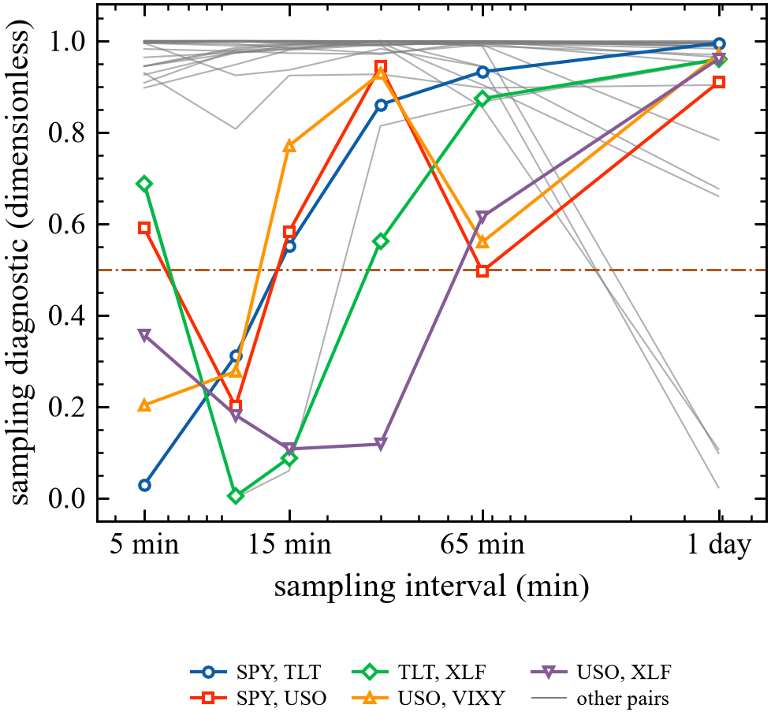
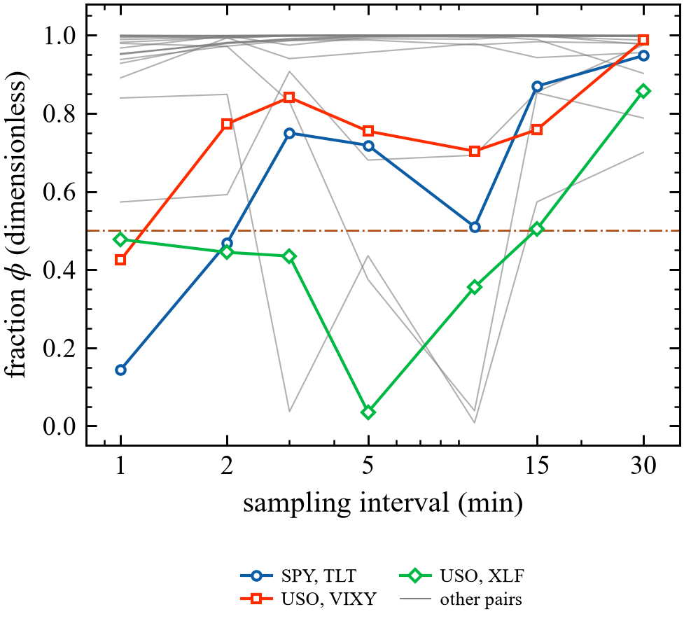
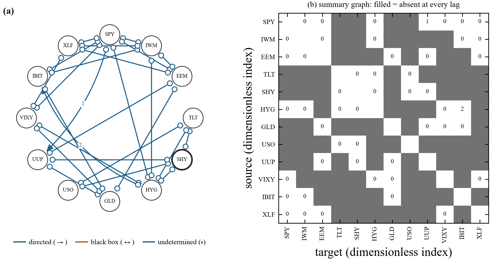
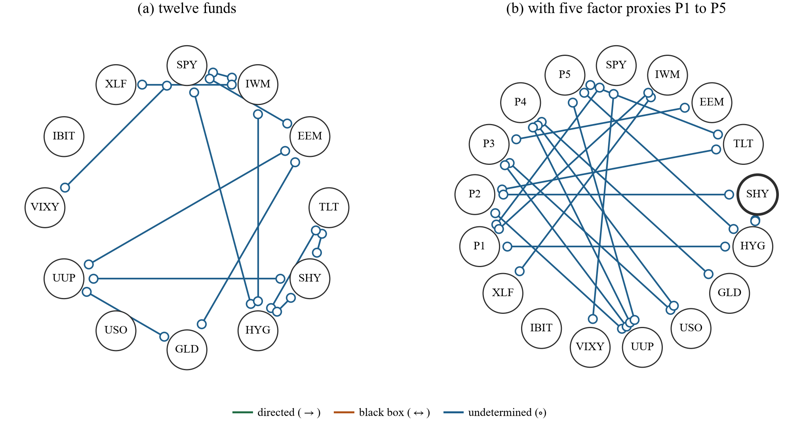
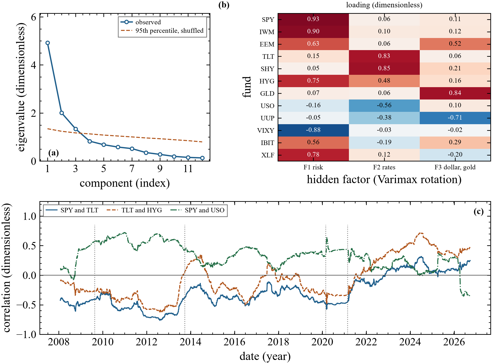
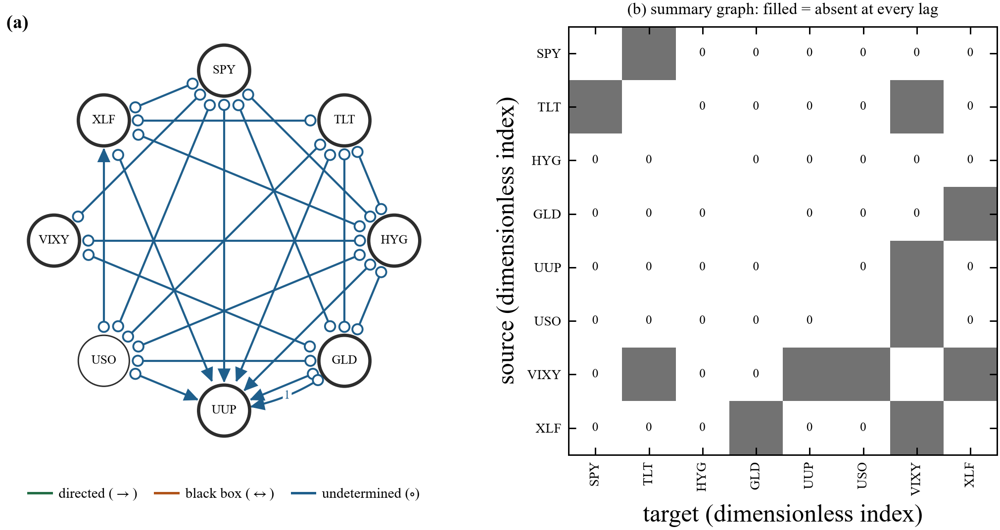
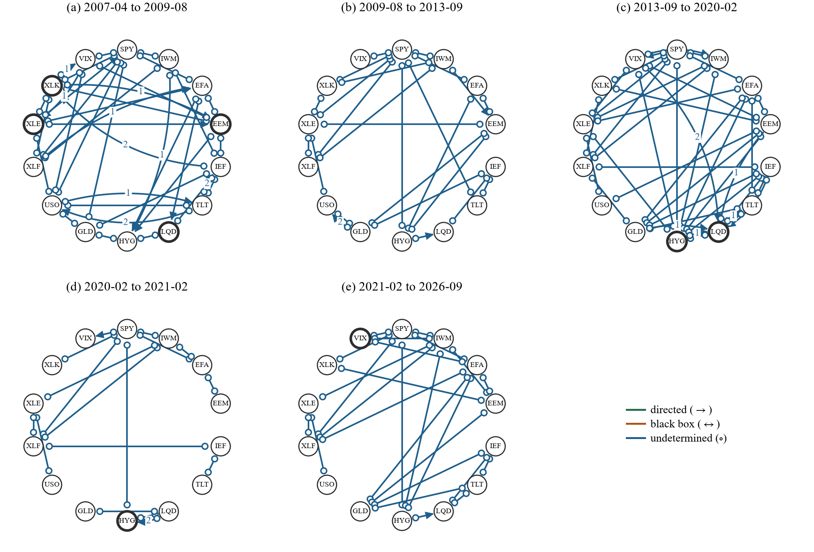
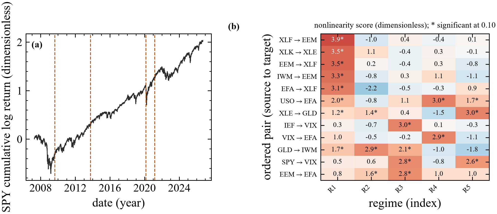
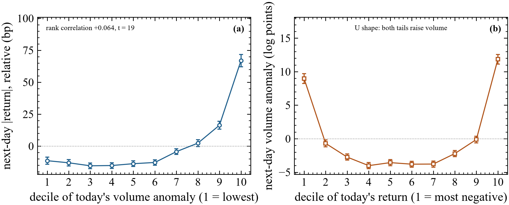
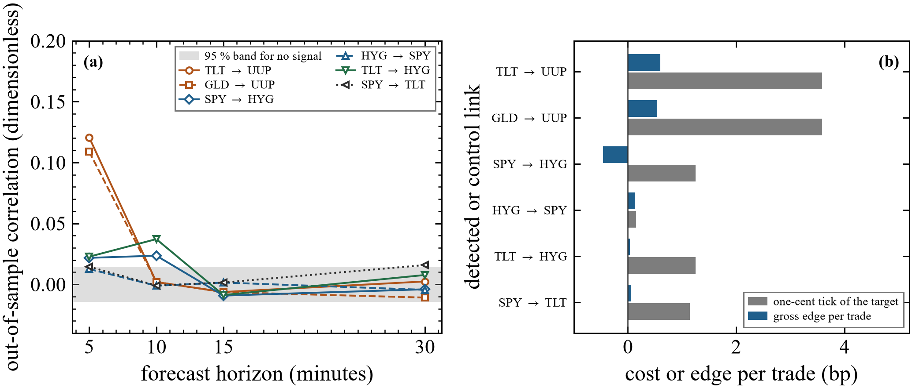

# Across asset classes

[Back to the overview](../README.md) ·
[Single companies and options](single-companies.md) ·
[Validation](validation.md)

Data: exchange-traded funds (ETFs) across equities, rates, credit,
commodities, currencies, volatility and crypto; 1-minute and 5-minute bars for
two years, and daily bars for 2007 to 2026. Every number comes from full-size
runs, with each structure search repeated on 20 subsamples, two other maximum
lags and two coarser sampling intervals.

## Contents

1. [Bar data rarely reveal who drives whom](#bar-data-rarely-reveal-who-drives-whom)
2. [The daily network, and what hidden drivers explain](#the-daily-network-and-what-hidden-drivers-explain)
3. [Three hidden drivers, and the 2021 break](#three-hidden-drivers-and-the-2021-break)
4. [A microstructure artefact, caught](#a-microstructure-artefact-caught)
5. [Twenty years of regimes](#twenty-years-of-regimes)
6. [Volume forecasts volatility, not direction](#volume-forecasts-volatility-not-direction)
7. [Intraday lead and lag does not pay for the tick](#intraday-lead-and-lag-does-not-pay-for-the-tick)

## Bar data rarely reveal who drives whom

The diagnostic for eight ETFs as the sampling interval grows from 5 minutes to
one day, over 489 trading sessions. Above the dashed line the dependence
between the two assets is too fast for that interval to reveal its direction.
At 5 minutes, 23 of the 28 pairs are already above it, and at one day 24 of 28
are. The five pairs that are resolved at 5 minutes all involve long Treasuries
(TLT) or crude oil (USO).

One-minute bars do not fix it. Over 462 sessions, 18 of 21 pairs of seven
funds are still unresolved at one minute: the fraction is 1.00 for the S&P
500 fund with the financial-sector fund, 0.98 with VIX futures and 0.94 with
high-yield credit. Only the S&P 500 with long Treasuries (0.14) and two pairs
involving crude oil fall below the threshold. The equity, credit and
volatility funds adjust to one another in less than a minute, as expected when
overlapping baskets and index futures are arbitraged, so no bar data can order
them in time. Direction inside that complex needs trade and quote records
time-stamped well below a minute.

## The daily network, and what hidden drivers explain

Twelve ETFs, 499 sessions. (a) Links found; circles mark ends the data leave
undetermined, arrowheads mark definite directions, numbers mark lags in days.
(b) Which pairs are connected at any lag. The data establish who is connected
(equities with implied volatility, equities with credit, the Treasury curve
with credit, the dollar with emerging markets and gold) but, consistent with
the sampling result, almost no directions. 55 of the 66 pairs are unresolved
at one day. All 13 links that pass false-discovery control appear in every one
of the 20 subsamples.

The same network after two refinements of the search, (a) on the twelve funds
alone and (b) with five measured stand-ins for market-wide drivers, built
from 22 other funds that are not in the graph (they carry 34, 16, 10, 8 and 6
percent of those funds' variance). Only links that pass false-discovery
control and appear in at least 80 percent of subsamples are drawn. The
refinements removed two lagged links that were artefacts of the search, and a
nonparametric re-check confirmed 21 of the remaining 24 links, including all
13 robust ones. With the driver stand-ins in the graph, the links between
funds fall from 24 to 12 and the robust ones from 13 to 3: the S&P 500 with
VIX futures, small caps with financials, and short Treasuries with high-yield
credit. Ten of the thirteen robust daily dependences are therefore carried by
drivers that are pervasive across other funds, and the three that remain are
the candidates for direct links.

## Three hidden drivers, and the 2021 break

(a) Only three common factors in the twelve daily ETF series rise above what
shuffled data produce; together they carry 69 percent of the variance (41, 17
and 11 percent). (b) After rotation they read as a risk factor (equities,
high-yield credit and bitcoin load positively, the volatility ETF at -0.88), a
rates factor (long and short Treasuries) and a dollar and gold factor (gold
+0.84, the dollar -0.71). None of the three is a traded series in the
dataset, which is why the daily network has so many links without directions.
(c) One-year rolling correlations, with the four regime breaks found from the
data as dotted lines. The stock and Treasury correlation sat between -0.36
and -0.58 in every regime before February 2021 and averages +0.08 since; the
one-year rolling value has been positive throughout 2023 to 2026. The
Treasury and high-yield correlation went from between -0.20 and -0.40 to
+0.40, and oil decoupled from equities (+0.33 to +0.58 before, +0.08 after).
Long Treasuries stopped hedging equities.

## A microstructure artefact, caught

The analysis on 5-minute bars, pooling all 489 sessions. Five of the six
same-bar arrowheads point into the dollar ETF (UUP), and so do two lagged
links, from long Treasuries and gold, which appear in every subsample. UUP has
about ten times more stale 5-minute bars than the others (4.9 percent against
0.45 percent), and stale prices make an illiquid instrument lag liquid ones
mechanically. The pipeline flags these arrowheads as a likely artefact rather
than evidence that the dollar is driven by the rest.

## Twenty years of regimes

Thirteen ETFs and the daily change in the VIX, 4,891 sessions. The regime
breaks were found from the data alone, with no dates supplied: 2009-08-19,
2013-09-24, 2020-02-25 and 2021-02-22, which bracket the end of the financial
crisis, the post-crisis recovery, the long expansion, the COVID year and the
period since. The mechanism of SPY, IWM, IEF, GLD, XLF and XLK changes across
these regimes; EFA, EEM, LQD, HYG, USO, XLE and the VIX show no detectable
change. Nonlinear links concentrate in the crisis regime (small caps, emerging
markets, financials) and, for oil to high-yield credit, after 2020. No lagged
link from one asset to another survives false-discovery control in any
regime, which fits weak daily predictability in liquid markets. Of the 80
links that do survive, 76 appear in at least 80 percent of the subsamples.

## Volume forecasts volatility, not direction

349 US stocks, 736 trading days, each variable measured against the same
day's cross-sectional average. (a) Today's volume anomaly ranks tomorrow's
absolute return with a rank correlation of +0.064 (t = 19), positive on 76
percent of days and equal in the two halves of the sample (0.060 and 0.069).
The effect is convex: the lower six deciles are flat and the top decile moves
about 0.8 percentage points more than they do the next day. It adds to
today's absolute return rather than repeating it (t = 9.7 with today's
absolute return held fixed). Volume does not predict the sign of tomorrow's
return (t = 1.7). (b) The reverse direction is U-shaped: large moves of
either sign raise tomorrow's volume.

## Intraday lead and lag does not pay for the tick

Every five-minute link found above, and controls, fitted on the first 244
sessions and tested on the next 245. (a) Out-of-sample correlation against
horizon. Treasuries and gold do lead the dollar ETF one bar ahead (0.12 and
0.11), and every signal is inside the no-signal band by 15 minutes. (b) The
gross edge of trading on those forecasts is about 0.6 basis points per trade,
against a one-cent minimum tick of 3.6 basis points on the dollar ETF. The
lead is real in the data but far too small to trade, as expected if it comes
from stale prices.
