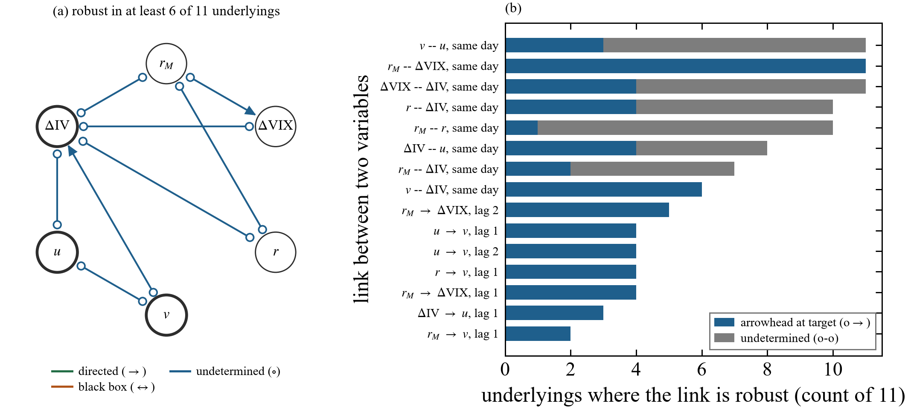
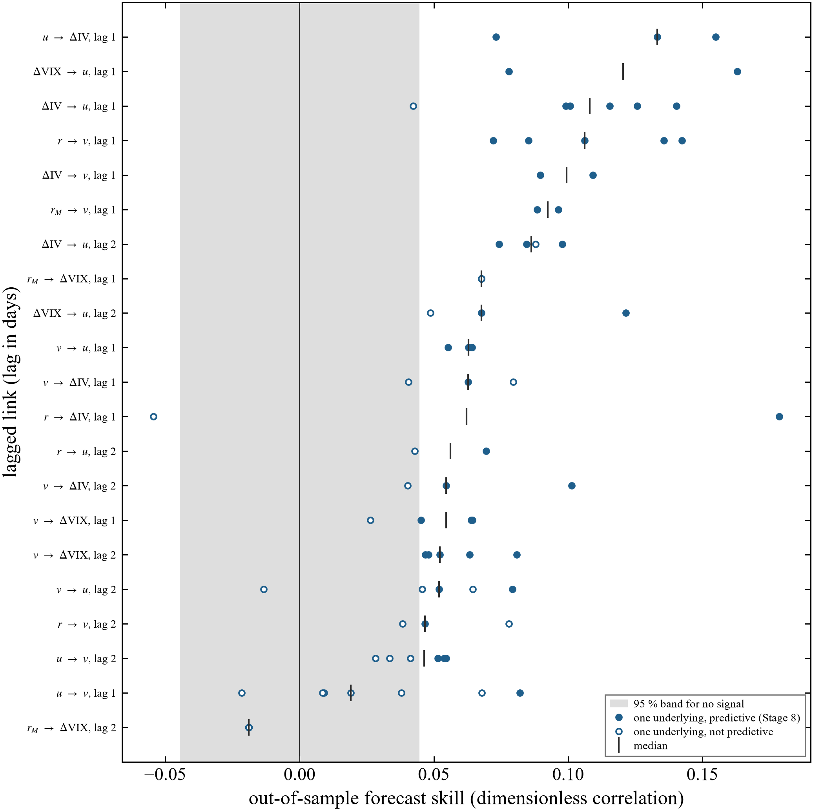

# Single companies and their options

[Back to the overview](../README.md) ·
[Across asset classes](cross-asset.md) ·
[Validation](validation.md)

The question at this scale: once the market-wide drivers are measured, which
of a company's own variables drive which? The variables are the company's
daily return, its intraday price range (a volatility measure), its abnormal
trading volume, and what its options say about expected volatility.

## Contents

1. [Implied volatility follows the stock and leads no return](#implied-volatility-follows-the-stock-and-leads-no-return)
2. [What does forecast, out of sample](#what-does-forecast-out-of-sample)
3. [Option-implied variables from contract data](#option-implied-variables-from-contract-data)
4. [Scheduled events settle same-day directions](#scheduled-events-settle-same-day-directions)
5. [The volume lead on implied volatility is the earnings calendar](#the-volume-lead-on-implied-volatility-is-the-earnings-calendar)
6. [What a machine-learning re-check adds](#what-a-machine-learning-re-check-adds)

Record: the 30-day implied-volatility indices of the Cboe Options Exchange for
eleven underlyings with continuous history, five companies (Apple, Amazon,
Alphabet, Goldman Sachs, IBM) and six funds (Nasdaq-100, Russell 2000,
emerging markets, Brazil, gold, oil), 3,858 sessions from March 2011 to
September 2026, one causal search per underlying. Each record also holds the
S&P 500 return and the daily change in the VIX as measured market-wide
drivers. The S&P 500 is run on its own with the VIX as its implied
volatility.

## Implied volatility follows the stock and leads no return

(a) Links that are robust (false-discovery control and at least 80 percent of
20 subsamples) in at least 6 of the 11 underlyings. Nodes: S&P 500 return
r_M, change in log VIX, the underlying's return r, range volatility v, volume
anomaly u and change in log implied volatility ΔIV. (b) In how many
underlyings each link is robust.

- A company's implied volatility moves with the VIX in all 11 underlyings,
  with its own return in 10 and with the market return in 7, including all
  five companies. Return and implied volatility move in opposite directions
  (daily correlation -0.24 for IBM to -0.57 for Goldman Sachs; -0.34 to
  -0.74 for the funds other than gold, whose implied volatility is
  uncorrelated with its return).
- Where the data could orient these links, every arrowhead points into the
  implied volatility and none out of it.
- No lagged link into a company's return is robust in any of the five
  companies, whether from its implied volatility, its range, its volume or
  the market. In fifteen years of daily data, implied volatility never has a
  robust lead on the next day's return.

## What does forecast, out of sample

Each lagged link fitted on the first half of its record and tested on the
second. A marker is one underlying; filled markers pass all three checks
(significant in the fitting half, outside the no-signal band, and a formal
test for nested forecasts). The grey band is the range expected with no
signal.

- A fall in price forecasts a wider range the next day, in all 5 underlyings
  where the link was tested (the leverage effect, one day ahead).
- A rise in implied volatility forecasts more trading the next day, in 5 of
  6.
- A day of wide range forecasts a lower VIX two days later, in 5 of 5.
- Median forecast skills are small, 0.05 to 0.13 (correlation of the link's
  contribution with the error of a forecast from the target's own past).

These are forecasts of activity and volatility. None of them is a forecast
of the direction of the next day's return.

## Option-implied variables from contract data

Daily bars of individual option contracts for two years (485 sessions; Apple,
NVIDIA and the Nasdaq-100 fund, with the S&P 500 fund separately), turned into
at-the-money implied volatility, a 10 percent out-of-the-money put skew, a
call-minus-put implied-volatility spread and option volume. The constructed
implied volatility tracks the Cboe indices (level correlation 0.96, daily
changes 0.71 to 0.73).

- The company's implied volatility follows the VIX on the same day, with the
  arrowhead at the company, in all three underlyings.
- Option volume moves with stock volume on the same day in all three, and
  with the skew in two.
- No option variable (implied volatility, skew, put-call spread, option
  volume) has a robust lead on the next day's return, range or volume. The
  predictive option signals reported in the literature are cross-sectional
  and at horizons of a week to a month, which this per-underlying daily
  study does not test.

## Scheduled events settle same-day directions

At daily resolution almost every same-day link keeps an undetermined end,
because the data cannot say which variable moved first. Scheduled events can
settle some of them. An earnings release or a Federal Reserve (FOMC)
statement has a date fixed weeks or months in advance, so nothing in the
market causes it, and it acts on some variables and not others: a natural
experiment. If an event visibly changes one end of a link and not the other,
the unchanged end cannot be driven by the changed one.

Events used: 61 or 62 earnings reaction sessions per company (2011 to 2026)
and 122 scheduled FOMC statement days. Each event type is analysed only on
days free of the other, because 15 of Apple's 62 earnings sessions fall on
FOMC days.

What each event changes:

- Earnings sessions change every company variable and neither market
  variable: the company's return moves 1.8 to 5.8 times as much as usual,
  its implied volatility falls by 2.4 to 6.6 standard deviations, volume
  rises by 1.9 to 3.1 and range by 1.2 to 1.9 standard deviations.
- FOMC days lower the VIX (by about 0.16 standard deviations, with 1.4 times
  its usual spread) in every record and barely change the market return.

Directions found (B: holds in both halves of the record, 2011 to 2018 and
2018 to 2026; L: in the later half only; *: also under a stricter setting;
a dash: no claim):

| Company | market return does not follow the company's return | market return does not follow the company's implied volatility | VIX does not follow the company's implied volatility | volume drives range on earnings days | VIX and company implied volatility share a driver (FOMC) |
|---|---|---|---|---|---|
| Apple | B* | B* | B* | B* | L* |
| Amazon | B* | B* | B* | B | - |
| Alphabet | B* | B* | B* | - | - |
| Goldman Sachs | L | L | B* | - | L* |
| IBM | L | L | B | - | - |

In all five companies, on the same day, neither the company's return nor its
implied volatility moves the market return or the VIX detectably. That is the
direction factor models assume; here the data support it instead of the
model assuming it. With about 60 events the test cannot see an effect as
small as one company's weight in the index, so the statement is "not
detectable", not "zero". For Apple and Goldman Sachs, FOMC days suggest that
the VIX and the company's implied volatility share a common driver rather
than one driving the other; that holds in the later half only and is a lead,
not a finding. In the funds, FOMC days oriented nothing that holds up.

In simulations with known answers, 92 to 98 percent of the directions this
step sets are correct, and it makes no claim when events change nothing
([validation](validation.md#scheduled-events)).

## The volume lead on implied volatility is the earnings calendar

An earlier forecasting result said that a day of abnormally heavy trading is
followed by a fall in implied volatility. With the earnings dates in hand:

- Over all sessions the lead is negative in all five companies (t = -2.2 to
  -6.6).
- Without the sessions around each earnings release it disappears (t = -1.1
  to +2.7).
- Volume is already 1.3 to 2.2 standard deviations above normal on the day of
  an after-close release, and implied volatility collapses on the next
  session (a fall of 0.21 to 0.30 in log units, against a daily standard
  deviation of about 0.07).

The lead is real and forecasts out of sample, and it carries nothing that
the published earnings calendar does not.

## What a machine-learning re-check adds

The structure search uses a fast rank-based test that sees only monotone
dependence. Every pair was re-checked with a test built on gradient-boosted
regressions, which also sees dependence on the size of a move and takes
about a second per test (nine minutes for all twelve records on one desktop).

| | per record | total |
|---|---|---|
| links confirmed | 14 to 24 | |
| links not confirmed (mostly weak two-day links) | 0 to 5 | 21 |
| relations the search missed | 8 to 25 | 193 |
| of which, relations of size | | 160 |
| of which, about the direction of a return | | 2 (correlations 0.07 and 0.08) |

The missed relations are almost all about magnitude: volume and range rise
after large moves in returns, the VIX and implied volatility, and the size of
the next day's move depends on today's range, volume and market move. This is
volatility clustering and the volume and volatility relation, which a graph
of signed variables cannot show. Machine learning therefore confirms the
graphs, adds links of magnitude, and finds no new predictability of the
direction of returns, in line with the forecasting results above.
