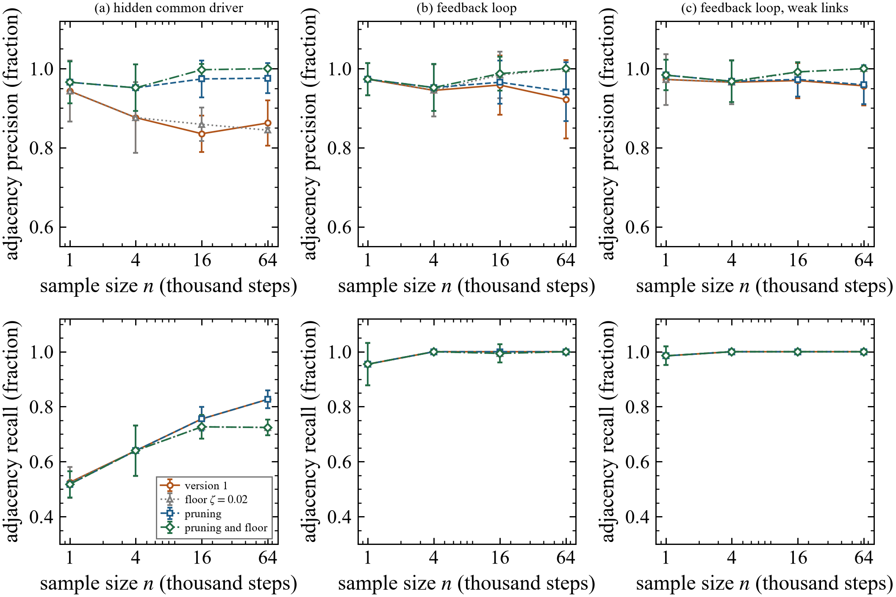
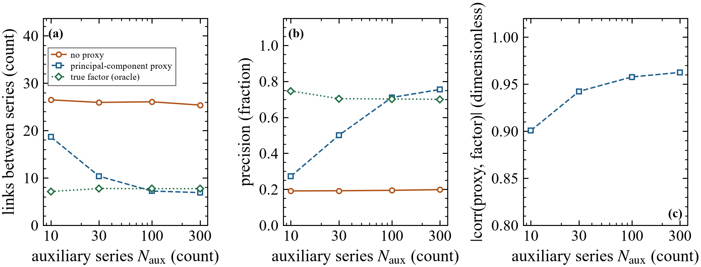

# Validation against known answers

[Back to the overview](../README.md) ·
[Across asset classes](cross-asset.md) ·
[Single companies and options](single-companies.md)

Before and alongside the market work, every stage was scored on simulated
systems whose true causal structure is known.

## Contents

1. [Wrong directions on hard systems](#wrong-directions-on-hard-systems)
2. [A trap for direction tests](#a-trap-for-direction-tests)
3. [Two problems found at scale, and fixed](#two-problems-found-at-scale-and-fixed)
4. [Measuring hidden drivers from outside the graph](#measuring-hidden-drivers-from-outside-the-graph)
5. [Scheduled events](#scheduled-events)
6. [A machine-learning test for the re-check](#a-machine-learning-test-for-the-re-check)
7. [Other checks](#other-checks)

## Wrong directions on hard systems

Fraction of causal marks (arrowheads and tails) that contradict the true
structure, on three systems: a hidden common driver, a feedback loop, and a
feedback loop with some near-vanishing links; 30 simulations per point. Over
all 450 runs this work made 3 wrong marks, each on a link that the
independence tests had wrongly admitted, and none on the feedback systems. Two
standard baselines made up to 14 percent (LPCMCI) and up to 35 percent
(SVAR-FCI) wrong marks, and their error grew with sample size on some
systems.

## A trap for direction tests

Two series share a hidden driver and have no link between them, but one is
observed with more noise. A standard net information-flow score points
confidently the wrong way (0.82 to 0.98). The test used here reported a false
direction in 3 of 200 trials, all of them in the equal-noise case where a 5
percent false-alarm rate is expected by design, and found the true direction
in 50 of 50 trials where a real one-way link existed.

## Two problems found at scale, and fixed

Running the search on up to 64,000 time steps exposed two problems. On the
system with a hidden driver, the share of reported links that are real fell
as the sample grew (0.94 at 1,000 steps, 0.86 at 64,000), because the search's
own conditioning created spurious links; on the feedback systems a few weak
spurious links remained. Two corrections address the two causes. With both,
precision is 1.00 from 16,000 steps on in all three systems; the first
correction alone holds the hidden-driver system at 0.95 to 0.98 with
unchanged recall. The price is recall on the hidden-driver system (0.72
instead of 0.83 at 64,000 steps), because very weak true links are dropped on
purpose. 30 simulations per point, mean and one standard deviation.

## Measuring hidden drivers from outside the graph

Six series with five true links, and one hidden driver acting on all of them
and on a panel of other series. (a) Without a stand-in for the driver, the
search reports about 26 links, of which only 19 to 20 percent are real: the
hidden driver connects everything. With a stand-in built from the other
series, the number falls to 6.9 and (b) the share of real links rises to 0.75
once the panel has 100 or more series, which matches using the true driver
itself (0.70 to 0.75). (c) The stand-in correlates 0.90 to 0.96 with the true
driver. Recall of the true links stayed at or above 0.99 and no mark
contradicted the true structure.

## Scheduled events

A simulated company, built like the market records: a market return, a
volatility index, the company's return, range and implied volatility, a
hidden news driver, heavy tails and volatility clustering. A central-bank
series (125 days) and an earnings series act on known variables. Seven
directions are identifiable in principle. 50 simulations of 3,858 days per
row; precision is the share of set directions that are correct.

| Setting | precision | directions found (of 7) | precision, stricter setting | found, stricter |
|---|---|---|---|---|
| 16 earnings days, strong | 0.92 | 1.6 | 1.00 | 1.2 |
| 31 earnings days, strong | 0.95 | 2.1 | 0.99 | 1.8 |
| 62 earnings days, strong | 0.95 | 2.8 | 0.98 | 2.3 |
| 125 earnings days, strong | 0.96 | 3.1 | 0.99 | 2.5 |
| 62 earnings days, weak | 0.98 | 2.0 | 1.00 | 1.6 |
| 62 earnings days, medium | 0.95 | 2.3 | 0.98 | 1.9 |
| 62 earnings days, strong, confounded with the market | 0.94 | 2.5 | 0.96 | 2.1 |
| events that change nothing | no claim in any run | 0 | no claim | 0 |

Most errors come from an event that changes both ends of a link with one of
the two changes too weak to detect. The stricter setting trades about a
quarter of the directions found for precision of 0.96 to 1.00, which is why
the market results report both.

## A machine-learning test for the re-check

Share of simulations in which each test reports a link, at the 5 percent
level, 200 simulations per case, 1,929 / 3,858 samples. Machine-learning
test: gradient-boosted regressions, about a second per test. Rank test: the
fast test used inside the search.

| Case | machine-learning test | rank test |
|---|---|---|
| no link: independent | 0.07 / 0.02 | 0.03 / 0.04 |
| no link: both depend on the size of a common move | 0.07 / 0.05 | 0.96 / 1.00 |
| no link: heavy tails and volatility clustering | 0.03 / 0.07 | 0.07 / 0.10 |
| no link: a strong irregular common driver | 0.43 / 0.39 | 1.00 / 1.00 |
| linear link | 0.94 / 1.00 | 1.00 / 1.00 |
| link through the square | 1.00 / 1.00 | 0.05 / 0.04 |
| link through the absolute value | 0.98 / 1.00 | 0.04 / 0.04 |

The machine-learning test keeps its false-alarm rate near 5 percent where
two variables share a dependence on the size of a common move, which the
rank test cannot handle, and it finds links through the square or the
absolute value, which the rank test misses. Under a strong irregular common
driver it raises too many false alarms; no test of this kind can avoid that
everywhere (Shah and Peters, 2020), so its flags are leads to inspect.

On a simulated company with a link from the size of yesterday's return to
today's range and no linear part, the search found the link in 0 to 4
percent of simulations and the re-check flagged it in 96 to 100 percent,
with 0.0 to 0.3 false flags per simulation. A first version of
the re-check produced 1.6 to 2.4 false flags per simulation, every one of
them created by conditioning on a variable caused by both ends of the pair;
testing each pair under several conditioning sets removed them.

## Other checks

Each against an exact answer, 50 simulations per setting.

| Check | Result |
|---|---|
| Coupling strength on a benchmark with known value | within 6 percent of the exact value |
| Number of planted hidden drivers | inside the reported range in 300 of 300 trials |
| Recovery of planted hidden drivers | Amari error index 0.009 to 0.034 (0 is perfect) |
| False alarms for nonlinearity on a linear system | 8 percent at a nominal 10 percent |
